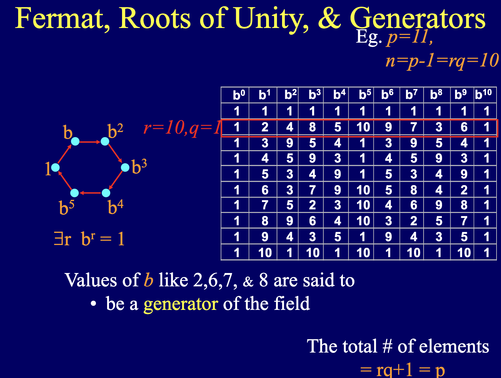

# Root of Unity

curve order of bn128 = 21888242871839275222246405745257275088548364400416034343698204186575808495617

multiplicative order: multiply a number by itself until it reaches 1 [src](https://en.wikipedia.org/wiki/Multiplicative_order) 

## primitive root

Finding a primitive root for a general group can be a non-trivial task. However, for certain groups, like the multiplicative group modulo p where p is prime, there are efficient algorithms to find a primitive root.

## primitive root definition

1. multiplicative order is equal to the group order-1 [src](https://math.stackexchange.com/questions/795414/what-are-primitive-roots-modulo-n)
[Source](https://slideplayer.com/slide/6669460/)
In this table, b=2, 6, 7, 8 are primitive root. A primitive root is a number that can generate all the non-zero residues modulo n when raised to varying powers.

2. a number 𝑔 is a primitive root modulo 𝑛 if every number coprime to 𝑛 is congruent to a power of 𝑔 modulo 𝑛 [src](https://math.stackexchange.com/questions/795414/what-are-primitive-roots-modulo-n)

## Finding 1 primitive root

For each integer g from 2 to p−1:
a. For each prime factor q_i p−1:
i. Compute h=g^[(p−1)/q_i] modp. 
ii. If ℎ = 1 mod h=1 mod p for any q_i , then g is not a primitive root. Break and try the next g.
b. If ℎ ≠ 1 mod h =1 mod p for all prime factors q_i of p−1, then g is a primitive root.

## Finding more

g is primitive root then g^2 is, so on and so forth.

## Primitive Root in this example

